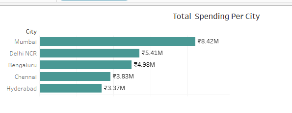

# Project:Mitron-Bank-Analysis-Project

## Table of Contents
1. [Overview](#overview)
2. [Data Structure & Initial Checks](#data-structure--initial-checks)
3. [Findings and Recommendations](#findings-and-recommendations)
4. [Conclusion](#conclusion)
5. [Acknowledgments](#acknowledgments)

## Overveiw
**Mitron Bank**, a prestigious legacy financial institution based in **Hyderabad**, is poised to expand its product portfolio by introducing an **innovative line of Payment cards**. As part of this strategic initiative, we aim to conduct a comprehensive analysis of **customer spending behaviors** to inform the development of these new financial products.

### Key Objectives:
- **Customer Segmentation**: Identifying which customer segments exhibit the **highest spending levels**, allowing for tailored marketing strategies and product features.
- **Spending Categories**: Analyzing the categories where customers allocate their expenses the most, whether it be **travel**, **dining**, **retail**, or other areas, to enhance card offerings with relevant rewards and benefits.
- **Payment Methods**: Evaluating the most popular payment methods utilized by customers, which will inform our decision on the features and functionalities of the new credit cards.

By understanding these dynamics, Mitron Bank will be well-equipped to introduce a payment card product line that not only meets the diverse needs of its customers but also positions the bank competitively in the financial market. This initiative aims to foster **customer loyalty**, increase **market share**, and enhance overall **satisfaction** with our banking services.

The **SQL** queries used to **analyze and clean** the data can be found [here](https://github.com/Maaz-Umar-00/Mitron-Bank-Analysis-Project/blob/main/01_Payment_card_Analysis_in_Sql.ipynb).\
The **Tableau Dashboard** can be found [here](https://public.tableau.com/app/profile/maaz.umar/viz/MitronBankAnalysis_17266593076560/05_credit_card_dashboard)

## Data Structure & Initial Checks
The dataset used for this analysis is sourced from [https://codebasics.io/challenge/codebasics-resume-project-challenge/11]) and includes two tables dim_customers and fact_spends with the following features:
### Column Details For Dim_customers Table:
- `customer_id:` This column represents the Unique ID assigned to each customer.
- `gender:` This column represents the gender of the customer. (Male, Female)
- `age_group`: This column categorizes the customer into different age groups. (21-24, 25-34, 35-45, 45+)
- `marital_status:` This column indicates the marital status of the customer (single, married).
- `city:` This column represents the city of residence for the customer. (Mumbai, Delhi-NCR, Chennai, Hyderabad, Bengaluru)
- `occupation:` This column denotes the occupation or profession of the customer. (Salaried IT Employees, Salaried Other Employees, Business Owners, Freelancers, Government Employees)
- `average_income:` This column indicates the monthly average income of the customer, in INR currency.
### Column Description For Fact_spends Table:

- `customer_id:` This column represents the Unique ID of each customer, linking to the dim_customer table.
- `month:` This column indicates the month in which the spending was recorded. (May, June, July, August, September, October)
- `category:` This column describes the category of spending (Entertainment, Apparel, Electronics, etc).
- `payment_type:` This column specifies the type of payment used by the customer (Debit Card, Credit Card, UPI, Net Banking).
- `spends:` This column shows the total amount spent by the customer in the specified month, category and payment_type.

## Findings and Recommendations
1. **Utility Spending Insights**:
   - The analysis reveals that people spend the most on **utility bills**, highlighting a significant area of consumer expenditure.
   - This suggests that Mitron Bank could consider launching new payment cards with **tailored rewards** for utility payments to enhance **customer engagement** and **card adoption.**

2. **City-Specific Spending Patterns**:
   - The analysis indicates that people spend the most in **Mumbai** and the least in **Hyderabad**, highlighting the need for tailored marketing strategies to maximize engagement in both markets.
   - This suggests that Mitron Bank should consider developing city-specific promotions and offers that resonate with the local consumer base.

 
3. **Payment Card Usage Among IT Employees**:
   - The analysis shows that **IT employees** use the most variety of payment cards, presenting an opportunity for Mitron Bank to offer specialized cards that cater to their diverse spending habits.
   - This could enhance customer loyalty and encourage greater usage of the bank’s offerings by providing tailored features and rewards that meet the specific needs of this demographic.

     
To access full **Tableau dashboard,** please click [here](https://public.tableau.com/app/profile/maaz.umar/viz/MitronBankAnalysis_17266593076560/05_credit_card_dashboard)\
To access **Sql queries** click [here](https://github.com/Maaz-Umar-00/Mitron-Bank-Analysis-Project/blob/main/01_Payment_card_Analysis_in_Sql.ipynb)

## Conclusion
This analysis provides valuable insights into **customer spending patterns** that can guide **Mitron Bank in introducing new credit card products.** By understanding the diverse needs and preferences of different customer segments, the bank can create tailored solutions that enhance customer engagement and loyalty.

## Acknowledgments
[code_basics](https://codebasics.io/challenge/codebasics-resume-project-challenge/11) for providing the dataset.
**Tableau** and **sql** for visualization and insights.

